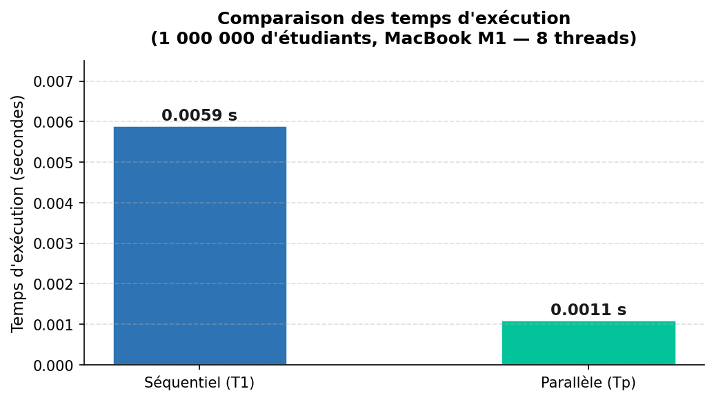
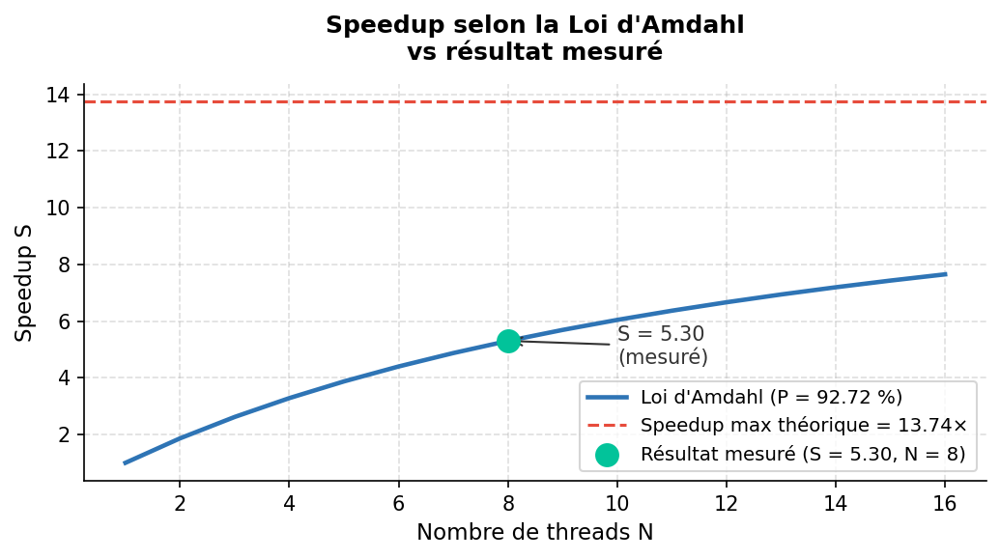
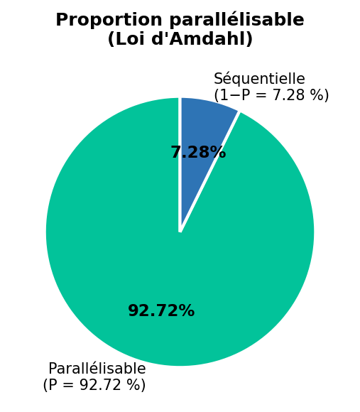

# TP Paralléliser un calcul de moyenne avec Numba

**Cours** : Programmation Parallèle  
**Enseignant** : Prof. Osias Noël TOSSOU (AIMS Sénégal / UVS)  
**Étudiante** : Ndeye Sokhna Nokho  
**Formation** : Master 1 Big Data Analytics, UNCHK 2024/2025  

---

## Présentation

Ce TP consiste à calculer la **moyenne pondérée des notes de 1 000 000 d'étudiants**
en deux versions (séquentielle et parallèle), puis à mesurer le gain de performance
via le **speedup** et la **loi d'Amdahl**.

```
Moyenne = (Maths × 5 + Physique × 4 + Anglais × 2) / 11
```

---

## Résultats obtenus (MacBook Pro M1, 8 threads)

| Indicateur | Valeur |
|---|---|
| Temps séquentiel T1 | 0.0059 s |
| Temps parallèle Tp | 0.0011 s |
| Speedup S = T1/Tp | **5.30** |
| Proportion parallélisable P | **92.72 %** |
| Speedup max théorique | **13.75** |

---

## Visualisations

### Comparaison des temps d'exécution



### Speedup selon la loi d'Amdahl



### Proportion parallélisable



---

## Structure du dépôt

```
TP_NUMBA_Programmation_Parallele/
│
├── tp_parallelisation_final.py   # Code Python complet (5 étapes)
├── etudiants.csv                 # Données générées (1 000 000 étudiants)
├── graph_temps.png               # Graphique comparaison des temps
├── graph_amdahl.png              # Graphique loi d'Amdahl
├── graph_proportion.png          # Graphique proportion parallélisable
└── README.md                     # Ce fichier
```

---

## Étapes du TP

**Étape 1** : Génération aléatoire de 1 000 000 d'étudiants avec NumPy, sauvegarde CSV

**Étape 2** : Version séquentielle compilée avec `@nb.jit(nopython=True)`

```python
for i in range(n):       # boucle classique, 1 thread
    moyennes[i] = (maths[i]*5 + physique[i]*4 + anglais[i]*2) / 11
```

**Étape 3** : Version parallèle avec `@nb.jit(nopython=True, parallel=True)`

```python
for i in nb.prange(n):   # prange distribue entre les 8 threads
    moyennes[i] = (maths[i]*5 + physique[i]*4 + anglais[i]*2) / 11
```

**Étape 4** : Calcul du speedup (formule cours Prof. TOSSOU, Chapitre 1)

```
S = T1 / Tp = 0.0059 / 0.0011 = 5.30
```

**Étape 5** : Loi d'Amdahl (formule cours Prof. TOSSOU, Chapitre 1)

```
A = 1 / ((1 - P) + P/N)
P = (1 - 1/A) / (1 - 1/N) = 92.72 %
```

---

## Comment exécuter

```bash
pip install numpy numba
python tp_parallelisation_final.py
```

---

## Références

- TOSSOU, O. N. Cours de Programmation Parallèle, Chapitre 1 et 2. AIMS Sénégal / UVS, 2024/2025
- Documentation Numba : https://numba.readthedocs.io
